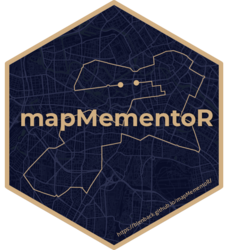

```{r, include = FALSE}
knitr::opts_chunk$set(
  comment = "#>",
  fig.path = "man/figures/README-",
  out.width = "100%"
)
```

# mapMementoR <a href="https://pkgdown.r-lib.org"></a>

<!-- badges: start -->
<!-- badges: end -->

## Introduction

This guide will help you create stunning, printable maps of your race routes using GPX data. The code lets you generate beautiful visualizations with customizable color schemes, elevation profiles, and multiple race times for the same location.

::: {layout-ncol=3}
{fig-alt="Example race map with Dark theme" group="my-gallery"}

{fig-alt="Example race map with Emerald theme" group="my-gallery"}

{fig-alt="Example race map with Ghost theme" group="my-gallery"}

{fig-alt="Example race map with Zen theme" group="my-gallery"}

{fig-alt="Example race map with Obsidian theme" group="my-gallery"}

{fig-alt="Example race map with Nautical theme" group="my-gallery"}
:::

## Getting Started

### Prerequisites

You'll need:

- R (version 4.0+)
- GPX files from your races (from Garmin, Strava, etc.)
- The required R packages (see Installation)


``` r
# install.packages("pak")
pak::pak("blenback/mapMementoR")
```

## Basic Usage

The simplest way to create maps is:

```r
source("create_maps.R")
memento_map_series(
  races_path = "your_races.yaml",
  styles_path = "styles.yaml",
  output_dir = "my_maps"
)
```

For a comprehensive introduction, configuration, and advanced usage, see the vignette: [Introduction to mapMementoR](vignettes/mapMementoR.qmd).
  races_path = "alex_black_races.yaml",
  styles_path = "styles.yaml",
  output_dir = "my_maps"
)
```

This will process all races in your YAML file with all defined styles.

## Configuration Files

### Race Data File (`*_races.yaml`)

This file contains your race information. Each race needs:

- **gpx_file**: Path to your GPX file
- **competitor_name**: Your name
- **event**: Race type (HM = half marathon, Mar = marathon, etc.)
- **location**: Race location name
- **entries**: List of race times for this location/course

#### Example Structure

```yaml
  - gpx_file: "data/london.gpx"
    competitor_name: "Alex Black"
    event: "Mar"
    entries:
      - race_year: "2025"
        race_time: "2:28:09"
      - race_year: "2024"
        race_time: "2:30:45"
      - race_year: "2023"
        race_time: "2:35:48"
  
  - gpx_file: "data/chicago.gpx"
    competitor_name: "Alex Black"
    event: "Mar"
    location: "Chicago"
    entries:
      - race_year: "2024"
        race_time: "2:31:46"
```

#### Adding New Races

To add a new race:

1. Save your GPX file to the `data/` directory
2. Add a new entry to your `*_races.yaml` file:

```yaml
  - gpx_file: "data/new_race.gpx"
    competitor_name: "Your Name"
    event: "HM"
    location: "New Location"
    entries:
      - race_year: "2025"
        race_time: "1:25:30"
```

3. Run `memento_map_series()` again

#### Automatic Data Import from Power of 10

If your races are listed on Power of 10, you can automatically generate the YAML structure:
  first_name = "Alex",
  surname = "Black",
  club = "North Shields Poly",
  event = c("HM", "Mar"),  # Filter to half marathons and marathons
  year = c(2023, 2024, 2025)  # Optional: filter by year
)
```

This creates a YAML file with all your race entries. You'll need to manually add the GPX file paths.

### Styles File (`styles.yaml`)

This file defines the visual appearance of your maps. You can create multiple styles to see which you prefer.

#### Anatomy of a Style
```yaml
styling:
  - name: "Dark"              # Style name (used for folder naming)
    route_color: "#d1af82"    # Color of your route line
    bg_color: "#0a0e27"       # Background/map color
    street_color: "#1a1f3a"   # Minor streets color
    highway_color: "#2d3250"  # Major roads color
    water_color: "#1a2332"    # Water bodies color
    with_elevation: true      # Include elevation profile
    dpi: 300                  # Print quality (300 for high quality)
    page_size: "A5"           # Output size (A5, A4, A3, A2, A1, A0)
```

#### Understanding Color Codes

Colors are specified in **hexadecimal format** (`#RRGGBB`):

- `#000000` = Black
- `#FFFFFF` = White
- `#FF0000` = Red
- `#00FF00` = Green
- `#0000FF` = Blue

**Finding Colors:**

- Use online tools like [Coolors.co](https://coolors.co/) or [HTML Color Codes](https://htmlcolorcodes.com/)
- Pick colors from images using browser color pickers
- Use color palette generators for harmonious combinations

#### Pre-defined Style Examples

**Dark Theme** (default)
```yaml
  route_color: "#d1af82"    # Warm gold
  bg_color: "#0a0e27"       # Deep navy
  street_color: "#1a1f3a"   # Dark blue-grey
  water_color: "#1a2332"    # Dark teal
```

**Light/Zen Theme**
```yaml
- name: "Zen"
  route_color: "#2d2d2d"    # Charcoal
  bg_color: "#fafafa"       # Off-white
  street_color: "#eeeeee"   # Light grey
  highway_color: "#d4d4d4"  # Medium grey
  water_color: "#e8e8e8"    # Pale grey
```

**Bold/Obsidian Theme**
```yaml
- name: "Obsidian"
  route_color: "#ffd60a"    # Bright gold
  bg_color: "#000814"       # Pure black
  street_color: "#001d3d"   # Deep navy
  highway_color: "#003566"  # Medium navy
  water_color: "#000814"    # Black water
```

#### Creating Your Own Style

1. Copy an existing style block
2. Change the `name` to something unique
3. Modify colors to your preference
4. Test with a single race first

**Tips for good color combinations:**

- High contrast between `route_color` and `bg_color` for visibility
- Keep streets subtle (similar to background)
- Make highways slightly more visible than streets
- Consider the printing medium (screen vs paper)

#### Color Scheme Ideas

**Warm & Earthy**
```yaml
route_color: "#d4a574"  # Tan
bg_color: "#2d3142"     # Slate
water_color: "#4f5d75"  # Blue-grey
```

**Cool & Fresh**
```yaml
route_color: "#06ffa5"  # Mint green
bg_color: "#0d1321"     # Deep navy
water_color: "#1d2d44"  # Navy blue
```

**Sunset Vibes**
```yaml
route_color: "#ff6b35"  # Coral
bg_color: "#004e89"     # Deep blue
water_color: "#1a659e"  # Ocean blue
```

## Advanced Features

### Multi-Day/Stage Races

For races with multiple stages or days (like ultra-marathons or cycling tours), use the `create_multiday_map()` function:

```r
create_multiday_map(
  segments = list(
    list(gpx_file = "data/stage1.gpx", segment_name = "Stage 1: Mountains"),
    list(gpx_file = "data/stage2.gpx", segment_name = "Stage 2: Coast"),
    list(gpx_file = "data/stage3.gpx", segment_name = "Stage 3: Finish")
  ),
  competitor_name = "Alex Black",
  location = "Three Day Challenge",
  route_colors = c("#d1af82", "#82b4d1", "#d182a8"),
  output_dir = "output",
  dpi = 300,
  page_size = "A3"
)
```

### Elevation Profiles

Elevation profiles are automatically included when `with_elevation: true` in your style. They show:

- Total elevation gain/loss
- Elevation changes throughout the route
- Relative difficulty of different sections

To disable elevation profiles: `with_elevation: false`

### Output Sizes

Choose your output size based on intended use:

- **A5** (148 × 210mm): Small prints, phone backgrounds
- **A4** (210 × 297mm): Standard paper, framing
- **A3** (297 × 420mm): Large prints, posters
- **A2/A1/A0**: Very large format printing

Higher DPI values (300-600) are recommended for printing, while 150-200 DPI works for screen viewing.

## File Organization

Recommended folder structure:

```
project/
├── data/
│   ├── london.gpx
│   ├── chicago.gpx
│   └── *.rds (cached OSM data)
├── output/
│   ├── Dark/
│   │   ├── A5/
│   │   └── A3/
│   └

- **A5** (148 × 210mm): Small prints, phone backgrounds
- **A4** (210 × 297mm): Standard paper, framing
- **A3** (297 × 420mm): Large prints, posters
- **A2/A1/A0**: Very large format printing

Higher DPI values (300-600) are recommended for printing, while 150-200 DPI works for screen viewing.

## File Organization

Recommended folder structure:

```
project/
├── data/
│   ├── london.gpx
│   ├── chicago.gpx
│   └── *.rds (cached OSM data)
├── output/
│   ├── Dark/
│   │   ├── A5/
│   │   └── A3/
│   └── Zen/
│       └── A4/
├── alex_black_races.yaml
├── styles.yaml
└── create_maps.R
```

## Troubleshooting

### GPX File Issues

**Problem**: "No coordinates found"
- Ensure your GPX file contains track points (`<trkpt>`)
- Check file isn't corrupted
- Try re-exporting from your GPS device/app

### Missing Map Features

**Problem**: Some streets/water aren't showing
- The script caches OpenStreetMap data in `data/*.rds` files
- Delete these files to re-fetch fresh data
- Ensure you have internet connection when first running

### Color Not Appearing

**Problem**: Route color looks wrong
- Check hex code format (`#` followed by 6 characters)
- Ensure code is in quotes: `"#d1af82"`
- Try increasing contrast with background

### Font Issues

**Problem**: Text not appearing or wrong font
- The default font is "Outfit-VariableFont_wght"
- Ensure font files are in your `fonts/` directory
- Or change `font_family` to a system font like "Arial" or "Helvetica"

## Tips for Best Results

1. **GPX Quality**: Use tracks with good GPS signal for smooth routes
2. **Test Styles**: Try 2-3 color schemes to see what works best
3. **Print Tests**: Print at small size first to check colors
4. **Location Names**: Use clear, short names for better layout
5. **Multiple Entries**: The map beautifully shows progression over multiple years

## Example Workflow

```r
# 1. Get your race data
save_powerof10_to_yaml(
  first_name = "Your",
  surname = "Name",
  club = "Your Club",
  event = c("HM", "Mar")
)

# 2. Add GPX files to data/ folder
# 3. Edit the generated YAML to add gpx_file paths

# 4. Create maps with all styles
memento_map_series(
  races_path = "your_name_races.yaml",
  styles_path = "styles.yaml",
  output_dir = "my_maps"
)

# 5. Check output/Dark/A5/ for your maps!
```

## Next Steps

- Experiment with different color schemes
- Try different page sizes for various uses
- Create multi-day maps for ultra races
- Share your creations!

---

*For questions or issues, please refer to the source code comments in `create_maps.R`*