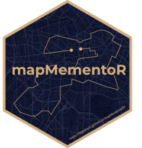
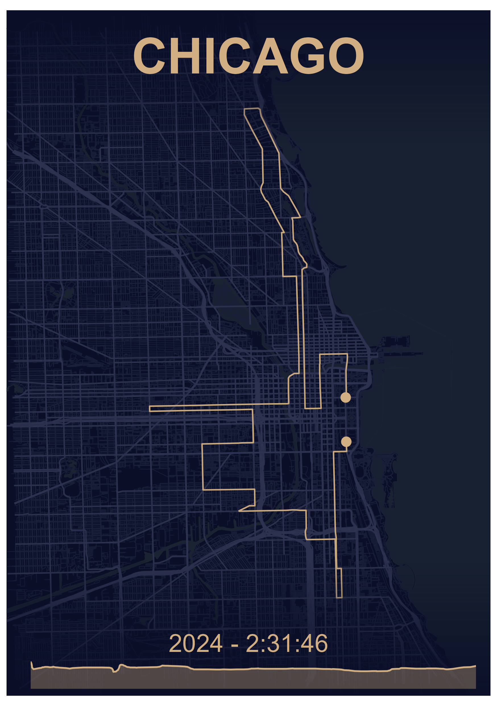

Ben Black

# mapMementoR <a href="https://pkgdown.r-lib.org"></a>

<!-- badges: start -->

<!-- badges: end -->

## Introduction

Create print-ready maps of your running routes, races, or multi-day
adventures using GPX data. `mapMementoR` generates visualizations with
customizable color schemes, elevation profiles, OpenStreetMap
backgrounds, and support for tracking multiple performances at the same
location.

<div layout-ncol="3">

<figure>

<figcaption aria-hidden="true">Example race map with Dark
theme</figcaption>
</figure>

<figure>

<figcaption aria-hidden="true">Example race map with Emerald
theme</figcaption>
</figure>

<figure>

<figcaption aria-hidden="true">Example race map with Ghost
theme</figcaption>
</figure>

<figure>

<figcaption aria-hidden="true">Example race map with Zen
theme</figcaption>
</figure>

<figure>

<figcaption aria-hidden="true">Example race map with Obsidian
theme</figcaption>
</figure>

<figure>

<figcaption aria-hidden="true">Example race map with Nautical
theme</figcaption>
</figure>

</div>

## Features

- **Single Route Maps**: Create elegant maps showing individual races
  with performance details
- **Multi-Track Maps**: Combine multiple GPX tracks on one map (perfect
  for multi-stage races or relay events)
- **Built-in Styles**: Six professionally designed color schemes (Dark,
  Emerald, Ghost, Nautical, Zen, Obsidian)
- **Customizable Appearance**: Full control over colors, fonts, page
  sizes, and map elements
- **Elevation Profiles**: Automatic generation of elevation charts from
  GPS data
- **OpenStreetMap Integration**: Beautiful background layers including
  streets, highways, water bodies, and coastlines
- **Batch Processing**: Generate maps for multiple races and styles
  simultaneously
- **Power of 10 Integration**: Automatically import UK running race data

## Installation

``` r
# install.packages("pak")
pak::pak("blenback/mapMementoR")
```

## Quick Start

### Single Race Maps

``` r
library(mapMementoR)

# Create maps for all races in your YAML file
memento_map_series(
  output_dir = "my_maps",
  races_path = "data-raw/my_races.yaml",
  styles = c("Dark", "Emerald"),
  page_size = "A4",
  dpi = 300
)
```

### Multi-Track Maps

``` r
# Create maps combining multiple tracks
multitrack_map_series(
  output_dir = "outputs",
  track_sets_path = "data-raw/track_sets.yaml",
  styles = c("Dark", "Zen"),
  page_size = "A3",
  with_labels = TRUE
)
```

## Configuration

### Race Data YAML

The race data file defines your races and performance entries. Example
`races.yaml`:

``` yaml
races:
  - gpx_file: "inst/extdata/london.gpx"
    competitor_name: "John Doe"
    location: "London"
    entries:
      - race_year: "2025"
        race_time: "2:28:09"
      - race_year: "2024"
        race_time: "2:30:45"
```

See `inst/extdata/races.yaml` for a complete example.

**Required fields:** - `gpx_file`: Path to GPX file - `competitor_name`:
Athlete name - `location`: Location label for the map - `entries`: List
of race entries with `race_year` and `race_time`

**Optional fields:** - `event`: Event type (HM, Mar, 5K, etc.) for
organization

### Track Sets YAML (for Multi-Track Maps)

For maps with multiple tracks (e.g., relay stages, multi-day events):

``` yaml
track_sets:
  - map_title: "City Relay\n2024"
    gpx_files:
      - "inst/extdata/leg1.gpx"
      - "inst/extdata/leg2.gpx"
      - "inst/extdata/leg3.gpx"
      - "inst/extdata/leg4.gpx"
    track_labels:
      - "Leg 1"
      - "Leg 2"
      - "Leg 3"
      - "Leg 4"
    elev_labels:
      - "Sarah"
      - "Mike"
      - "Emma"
      - "Tom"
    font_family: "Outfit-VariableFont_wght"
```

See `inst/extdata/track_sets.yaml` for a complete example.

**Optional configuration:** - `route_colors`: Custom colors for each
track (auto-generated if not specified) - `track_labels`: Labels placed
on the map - `elev_labels`: Labels for elevation profiles -
`font_family`: Custom font

### Automatic Import from Power of 10

Automatically create race YAML from UK running data:

``` r
save_powerof10_to_yaml(
  first_name = "Alex",
  surname = "Black",
  club = "North Shields Poly",
  event = c("HM", "Mar"),
  year = c(2023, 2024, 2025),
  yaml_path = "my_races.yaml"
)
```

This creates a YAML file with all your race entries. Add GPX file paths
manually.

## Customization

### Built-in Styles

Six professionally designed styles are included:

- **Dark**: Warm gold route on deep navy background
- **Emerald**: Dark green route on cream background  
- **Nautical**: Blue-grey route on warm cream background
- **Zen**: Charcoal route on light grey background
- **Ghost**: White route on dark background
- **Obsidian**: Bright gold route on black background

### Custom Styles

Create custom color schemes:

``` r
memento_map_series(
  races_path = "my_races.yaml",
  styles = c("Dark", "MyCustom"),
  custom_styles = list(
    MyCustom = list(
      route_color = "#FF6B35",    # Coral
      bg_color = "#004E89",        # Deep blue
      street_color = "#1A659E",    # Medium blue
      highway_color = "#2E86AB",   # Lighter blue
      water_color = "#1A659E"      # Ocean blue
    )
  )
)
```

### Map Components

Control which map elements to include:

``` r
memento_map_series(
  races_path = "my_races.yaml",
  with_elevation = TRUE,          # Include elevation profile
  with_OSM = TRUE,                # Include OpenStreetMap features
  with_hillshade = FALSE,         # Include terrain shading
  components = c(                 # Which OSM features to show
    "highways",
    "streets", 
    "water",
    "coast"
  ),
  fade_directions = c(            # Fade edges of map
    "top",
    "bottom"
  ),
  crop_shape = NULL               # Options: NULL, "circle", "ellipse"
)
```

### Page Formats

Supported page sizes for printing:

- **A5** (148 × 210mm): Small prints, digital use
- **A4** (210 × 297mm): Standard framing
- **A3** (297 × 420mm): Large prints, posters
- **A2, A1, A0**: Very large format printing

``` r
memento_map_series(
  races_path = "my_races.yaml",
  page_size = "A3",
  orientation = "portrait",  # or "landscape"
  dpi = 300,                 # 300 for print, 150 for screen
  base_size = 12             # Base font size
)
```

## Advanced Features

### Color Generation for Multi-Track Maps

When creating multi-track maps, route colors can be automatically
generated from the base style color:

``` r
multitrack_map_series(
  track_sets_path = "track_sets.yaml",
  styles = c("Dark"),
  track_color_method = "hue_shift"  # Options: "hue_shift", "complementary", "gradient"
)
```

- **hue_shift**: Creates colors by varying hue (default)
- **complementary**: Generates complementary and analogous colors
- **gradient**: Creates colors with varying lightness and saturation

### Caching OSM Data

OpenStreetMap data is cached by default to speed up regeneration:

``` r
memento_map_series(
  races_path = "my_races.yaml",
  cache_data = TRUE  # Set to FALSE to always fetch fresh data
)
```

Cached files are stored in `data_cache_tmp/` as `.rds` files. Delete
these files to refresh OSM data for a location.

### Circular and Ellipse Cropping

Create artistic cropped maps:

``` r
memento_map_series(
  races_path = "my_races.yaml",
  crop_shape = "circle"  # Options: NULL, "circle", "ellipse"
)
```

When using circular cropping, text overlays are automatically
repositioned for optimal appearance.

## File Organization

Recommended folder structure:

    project/
    ├── data-raw/
    │   ├── london.gpx
    │   ├── chicago.gpx
    │   └── *.rds (cached OSM data)
    ├── output/
    │   ├── Dark/
    │   │   ├── A5/
    │   │   └── A3/
    │   └

    - **A5** (148 × 210mm): Small prints, phone backgrounds
    - **A4** (210 × 297mm): Standard paper, framing
    - **A3** (297 × 420mm): Large prints, posters
    - **A2/A1/A0**: Very large format printing

    Higher DPI values (300-600) are recommended for printing, while 150-200 DPI works for screen viewing.

    ## Output Structure

    Maps are organized by style, page size, and crop shape:

output_dir/ ├── Dark/ │ ├── A4/ │ │ └── full_page/ │ │ ├── London.png │
│ └── Chicago.png │ └── A3/ │ └── circle/ │ └── London.png └── Emerald/
└── A4/ └── full_page/ └── London.png


    ## Low-Level Functions

    For programmatic control, use the core functions directly:

    ```r
    # Single race map
    create_memento_map(
      gpx_file = system.file("extdata", "london.gpx", package = "mapMementoR"),
      competitor_name = "John Doe",
      location = "London",
      entries = list(
        list(race_year = "2025", race_time = "2:28:09"),
        list(race_year = "2024", race_time = "2:30:45")
      ),
      route_color = "#d1af82",
      bg_color = "#0a0e27",
      street_color = "#1a1f3a",
      highway_color = "#2d3250",
      water_color = "#1a2332",
      output_dir = "maps",
      dpi = 300,
      page_size = "A4",
      orientation = "portrait"
    )

    # Multi-track map
    create_multitrack_memento_map(
      gpx_files = system.file("extdata", c("leg1.gpx", "leg2.gpx", "leg3.gpx", "leg4.gpx"), 
                             package = "mapMementoR"),
      track_labels = c("Leg 1", "Leg 2", "Leg 3", "Leg 4"),
      elev_labels = c("Sarah", "Mike", "Emma", "Tom"),
      route_colors = c("#d1af82", "#82b4d1", "#d182a8", "#d1af82"),
      map_title = "City Relay\n2024",
      output_dir = "maps",
      page_size = "A3",
      with_labels = TRUE
    )

## Troubleshooting

**GPX File Issues** - Ensure GPX files contain track points (`<trkpt>`
elements) - Check files aren’t corrupted by opening in a text editor -
Try re-exporting from your GPS device or app (Garmin Connect, Strava,
etc.)

**Missing Map Features** - OSM data is cached in `data_cache_tmp/*.rds`
files - Delete cache files to fetch fresh OpenStreetMap data - Ensure
internet connection when first running for each location

**Color Issues** - Use hex format: `"#RRGGBB"` (6 characters after \#) -
Ensure adequate contrast between route and background colors - Test
colors on screen before printing

**Font Issues** - Default font is “Outfit-VariableFont_wght” - Place
custom fonts in `fonts/` directory - Or use system fonts: “Arial”,
“Helvetica”, “Times New Roman”

**Memory Issues with Large Maps** - Reduce `dpi` value (e.g., 150
instead of 300) - Limit number of map components - Process styles one at
a time instead of all at once

## Tips for Best Results

1.  **GPX Quality**: Use tracks recorded with good GPS signal for
    smooth, accurate routes
2.  **Test First**: Generate one map with one style before batch
    processing
3.  **Print Tests**: Print at small size first to verify colors appear
    as expected
4.  **Multiple Performances**: The package beautifully displays
    progression across multiple years
5.  **Naming**: Use clear, concise location names for better layout
6.  **Caching**: Keep cache enabled (`cache_data = TRUE`) for faster
    regeneration

## Related Functions

``` r
# Parse GPX files
track_data <- parse_gpx("data-raw/race.gpx")

# Get track statistics
stats <- get_track_stats(track_data)

# Generate color palettes
colors <- generate_track_colors(
  base_color = "#d1af82",
  n_colors = 5,
  method = "hue_shift"
)

# Get page dimensions
dims <- get_page_dimensions(page_size = "A4", orientation = "portrait")
```

## Examples

See the package vignettes for detailed examples:

- [Introduction to mapMementoR](articles/mapMementoR.html)
- Single race maps
- Multi-track maps
- Custom styling
- Batch processing workflows

## License

MIT + file LICENSE

------------------------------------------------------------------------

*For questions, feature requests, or bug reports, please open an issue
on GitHub.*
