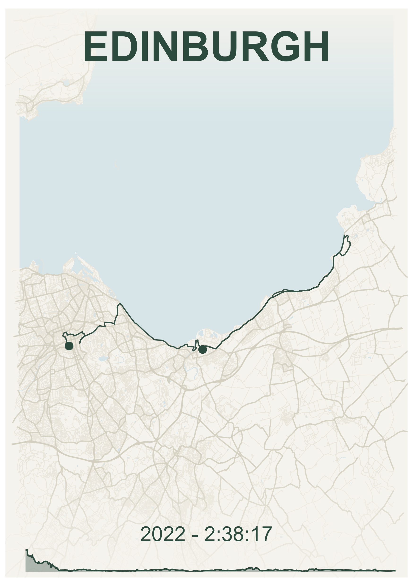
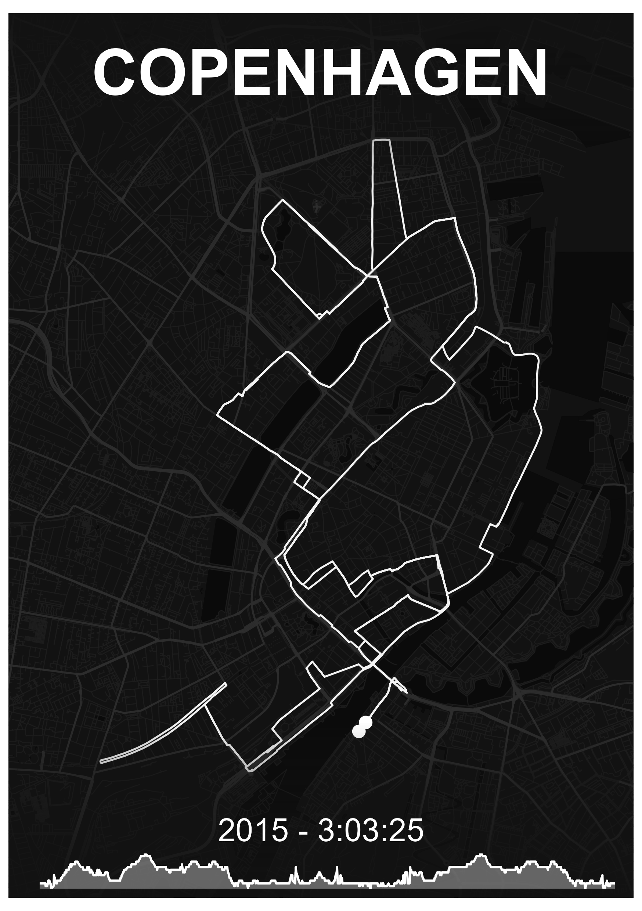
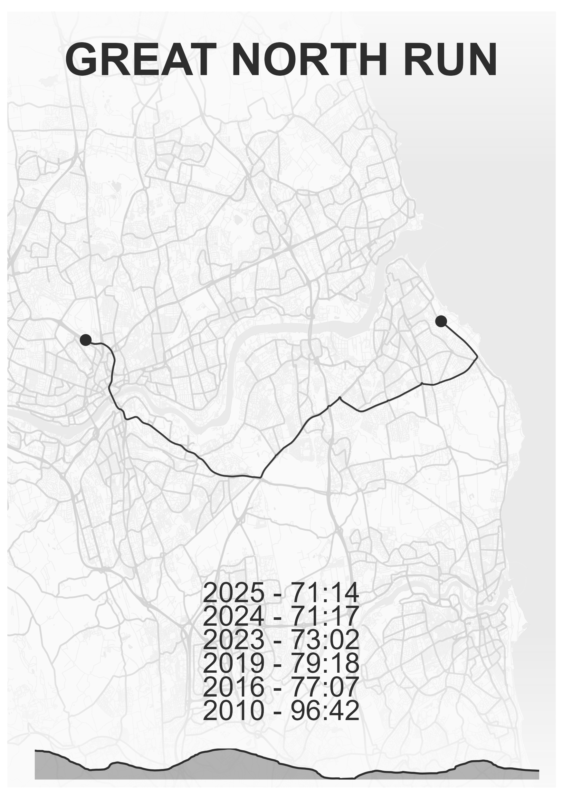
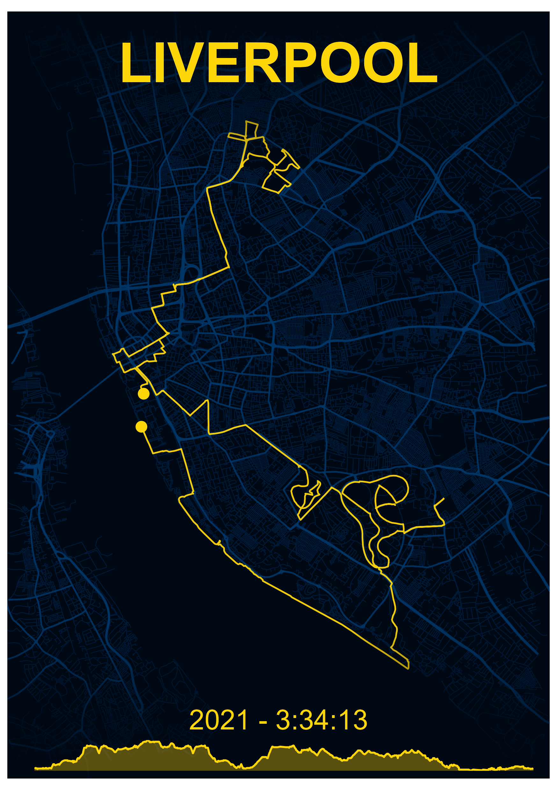

## Introduction

`mapMementoR` includes six professionally designed map styles, each carefully crafted to create beautiful, print-ready visualizations of your routes. Each style defines a complete color palette including route color, background, streets, highways, and water bodies.

This vignette demonstrates how to use built-in styles and create custom color schemes.

::: {layout-ncol=3}
{fig-alt="Example race map with Dark theme" group="my-gallery"}

{fig-alt="Example race map with Emerald theme" group="my-gallery"}

{fig-alt="Example race map with Ghost theme" group="my-gallery"}

{fig-alt="Example race map with Zen theme" group="my-gallery"}

{fig-alt="Example race map with Obsidian theme" group="my-gallery"}

{fig-alt="Example race map with Nautical theme" group="my-gallery"}
:::

## Style Specifications

```{r, echo=FALSE, message=FALSE}
library(knitr)
styles <- list(
  Dark = list(
    route_color = "#d1af82",
    bg_color = "#0a0e27",
    street_color = "#1a1f3a",
    highway_color = "#2d3250",
    water_color = "#1a2332"
  ),
  Emerald = list(
    route_color = "#2d4a3e",
    bg_color = "#f5f3ed",
    street_color = "#e8e4d8",
    highway_color = "#d4cfc0",
    water_color = "#d4e3e8"
  ),
  Nautical = list(
    route_color = "#2c3e50",
    bg_color = "#f7f4ed",
    street_color = "#e9e4d8",
    highway_color = "#d5cfc0",
    water_color = "#c8d8e3"
  ),
  Zen = list(
    route_color = "#2d2d2d",
    bg_color = "#fafafa",
    street_color = "#eeeeee",
    highway_color = "#d4d4d4",
    water_color = "#e8e8e8"
  ),
  Ghost = list(
    route_color = "#ffffff",
    bg_color = "#121212",
    street_color = "#1e1e1e",
    highway_color = "#2d2d2d",
    water_color = "#0a0a0a"
  ),
  Obsidian = list(
    route_color = "#ffd60a",
    bg_color = "#000814",
    street_color = "#001d3d",
    highway_color = "#003566",
    water_color = "#000814"
  )
)

# Create a nicely formatted table
style_df <- do.call(rbind, lapply(names(styles), function(n) {
  cbind(Style = n, as.data.frame(styles[[n]], stringsAsFactors = FALSE))
}))

knitr::kable(
  style_df,
  caption = "Built-in map style color specifications",
  col.names = c("Style", "Route", "Background", "Streets", "Highways", "Water")
)
```

## Style Descriptions

### Dark
A modern, sophisticated dark theme perfect for dramatic presentations.

- **Best for**: Marathon routes, urban races, dramatic wall art
- **Route**: Warm gold (#d1af82) stands out beautifully against dark background
- **Vibe**: Professional, modern, high-contrast

### Emerald
A fresh, natural theme with forest green tones.

- **Best for**: Trail runs, hiking routes, nature-focused maps
- **Route**: Forest green (#2d4a3e) on cream background
- **Vibe**: Organic, calm, vintage-inspired

### Nautical
Classic maritime-inspired colors reminiscent of nautical charts.

- **Best for**: Coastal routes, waterfront races, classic presentations
- **Route**: Blue-grey (#2c3e50) with warm cream background
- **Vibe**: Traditional, elegant, timeless

### Zen
Minimalist monochrome design for clean, modern aesthetics.

- **Best for**: Minimalist decor, professional presentations, clean design
- **Route**: Charcoal (#2d2d2d) on light grey background
- **Vibe**: Minimal, professional, versatile

### Ghost
High contrast reversed design with white routes.

- **Best for**: Modern interiors, night runs, striking visual impact
- **Route**: White (#ffffff) on near-black background
- **Vibe**: Bold, contemporary, dramatic

### Obsidian
Bold black background with brilliant gold routes.

- **Best for**: Trophy races, special achievements, luxury feel
- **Route**: Bright gold (#ffd60a) on pure black
- **Vibe**: Luxurious, celebratory, premium

## Using Built-in Styles

### Single Style

```{r, eval=FALSE}
library(mapMementoR)

# Use a single built-in style
memento_map_series(
  races_path = system.file("extdata", "races.yaml", package = "mapMementoR"),
  output_dir = "maps",
  styles = c("Dark"),
  page_size = "A4",
  dpi = 300
)
```

### Multiple Styles

Generate maps in all styles to compare:

```{r, eval=FALSE}
# Generate maps in all six built-in styles
memento_map_series(
  races_path = system.file("extdata", "races.yaml", package = "mapMementoR"),
  output_dir = "maps",
  styles = c("Dark", "Emerald", "Nautical", "Zen", "Ghost", "Obsidian"),
  page_size = "A4",
  dpi = 300
)
```

### Multi-Track Maps

Built-in styles work seamlessly with multi-track maps:

```{r, eval=FALSE}
multitrack_map_series(
  track_sets_path = system.file("extdata", "track_sets.yaml", package = "mapMementoR"),
  output_dir = "maps",
  styles = c("Dark", "Zen"),
  page_size = "A3",
  with_labels = TRUE,
  track_color_method = "hue_shift"
)
```

## Creating Custom Styles

### Basic Custom Style

You can create your own color schemes alongside built-in styles:

```{r, eval=FALSE}
memento_map_series(
  races_path = "my_races.yaml",
  styles = c("Dark", "Sunset"),
  custom_styles = list(
    Sunset = list(
      route_color = "#FF6B35",    # Coral orange
      bg_color = "#004E89",        # Deep ocean blue
      street_color = "#1A659E",    # Medium blue
      highway_color = "#2E86AB",   # Sky blue
      water_color = "#1A659E"      # Ocean blue
    )
  )
)
```

### Multiple Custom Styles

```{r, eval=FALSE}
memento_map_series(
  races_path = "my_races.yaml",
  styles = c("Sunset", "Forest", "Arctic"),
  custom_styles = list(
    Sunset = list(
      route_color = "#FF6B35",
      bg_color = "#004E89",
      street_color = "#1A659E",
      highway_color = "#2E86AB",
      water_color = "#1A659E"
    ),
    Forest = list(
      route_color = "#6B8E23",    # Olive green
      bg_color = "#F5F5DC",        # Beige
      street_color = "#E8E4D8",
      highway_color = "#D4CFC0",
      water_color = "#87CEEB"      # Sky blue
    ),
    Arctic = list(
      route_color = "#4A90E2",    # Ice blue
      bg_color = "#FFFFFF",        # White
      street_color = "#E8F4F8",
      highway_color = "#B8D4E8",
      water_color = "#C8E6F5"
    )
  )
)
```

## Color Selection Tips

### Finding Color Palettes

1. **Online Tools**:
   - [Coolors.co](https://coolors.co/) - Generate color schemes
   - [Adobe Color](https://color.adobe.com/) - Color wheel and exploration
   - [Paletton](https://paletton.com/) - Advanced color scheme designer

2. **Inspiration Sources**:
   - Existing maps and posters
   - Photography from your race location
   - Brand guidelines (if creating branded maps)

### Color Relationships

```{r, eval=FALSE}
# Example: Create a cohesive palette from a base color
base_route <- "#d1af82"  # Starting with Dark theme's route color

memento_map_series(
  races_path = "my_races.yaml",
  styles = c("MyPalette"),
  custom_styles = list(
    MyPalette = list(
      route_color = base_route,
      bg_color = "#0a0e27",        # Very dark, high contrast
      street_color = "#1a1f3a",    # Slightly lighter than background
      highway_color = "#2d3250",   # More prominent than streets
      water_color = "#1a2332"      # Distinct but harmonious
    )
  )
)
```

### Contrast Guidelines

- **Route vs Background**: High contrast (>4.5:1) for readability
- **Streets vs Background**: Subtle (low contrast) to avoid clutter
- **Highways vs Streets**: Moderate difference for hierarchy
- **Water**: Distinct but harmonious with overall palette

## Testing Styles

### Quick Test Workflow

```{r, eval=FALSE}
# 1. Test with low DPI and small size first
memento_map_series(
  races_path = "my_races.yaml",
  styles = c("TestStyle"),
  custom_styles = list(
    TestStyle = list(
      route_color = "#FF6B35",
      bg_color = "#004E89",
      street_color = "#1A659E",
      highway_color = "#2E86AB",
      water_color = "#1A659E"
    )
  ),
  page_size = "A5",
  dpi = 150,
  output_dir = "test_maps"
)

# 2. Review on screen

# 3. If satisfied, generate final version
memento_map_series(
  races_path = "my_races.yaml",
  styles = c("TestStyle"),
  custom_styles = list(
    TestStyle = list(
      route_color = "#FF6B35",
      bg_color = "#004E89",
      street_color = "#1A659E",
      highway_color = "#2E86AB",
      water_color = "#1A659E"
    )
  ),
  page_size = "A3",
  dpi = 300,
  output_dir = "final_maps"
)
```

## Style Variations

### Light vs Dark Themes

```{r, eval=FALSE}
# Light theme characteristics
light_theme <- list(
  route_color = "#2d2d2d",    # Dark route on light background
  bg_color = "#fafafa",        # Very light background
  street_color = "#eeeeee",    # Slightly darker than background
  highway_color = "#d4d4d4",   # More prominent
  water_color = "#e8e8e8"      # Subtle
)

# Dark theme characteristics
dark_theme <- list(
  route_color = "#d1af82",    # Light route on dark background
  bg_color = "#0a0e27",        # Very dark background
  street_color = "#1a1f3a",    # Slightly lighter than background
  highway_color = "#2d3250",   # More prominent
  water_color = "#1a2332"      # Subtle
)
```

## Style-Specific Features

### Elevation Profiles

Elevation profiles automatically adapt to your chosen style:

```{r, eval=FALSE}
# Elevation chart uses route_color with transparency
memento_map_series(
  races_path = "my_races.yaml",
  styles = c("Dark"),
  with_elevation = TRUE,  # Route color will be used for elevation chart
  page_size = "A4"
)
```

### Hillshade Rendering

Hillshade (terrain relief) adjusts based on background color:

```{r, eval=FALSE}
# Light backgrounds get darker hillshade
# Dark backgrounds get lighter hillshade
memento_map_series(
  races_path = "my_races.yaml",
  styles = c("Dark", "Zen"),
  with_hillshade = TRUE,
  page_size = "A4"
)
```

## Print Considerations

### Light Styles for Printing

Light background styles (Emerald, Nautical, Zen) are more economical for printing:

```{r, eval=FALSE}
# Economical printing option
memento_map_series(
  races_path = "my_races.yaml",
  styles = c("Zen"),  # Minimal ink usage
  page_size = "A4",
  dpi = 300
)
```

### Dark Styles for Digital

Dark backgrounds (Dark, Ghost, Obsidian) work beautifully on screens:

```{r, eval=FALSE}
# Optimized for screen viewing
memento_map_series(
  races_path = "my_races.yaml",
  styles = c("Dark", "Ghost"),
  page_size = "A4",
  dpi = 150  # Lower DPI sufficient for screens
)
```

## Conclusion

Built-in styles provide professional, tested color combinations that work well for most use cases. Custom styles allow you to match specific branding, personal preferences, or thematic requirements.

**Key Takeaways**:

1. Start with built-in styles to understand what works
2. Test custom styles at low resolution first
3. Consider final medium (print vs screen) when choosing colors
4. Maintain adequate contrast for readability
5. Keep color palettes harmonious and cohesive

For more advanced customization, see the [OSM Components](osm_components.html) vignette.


